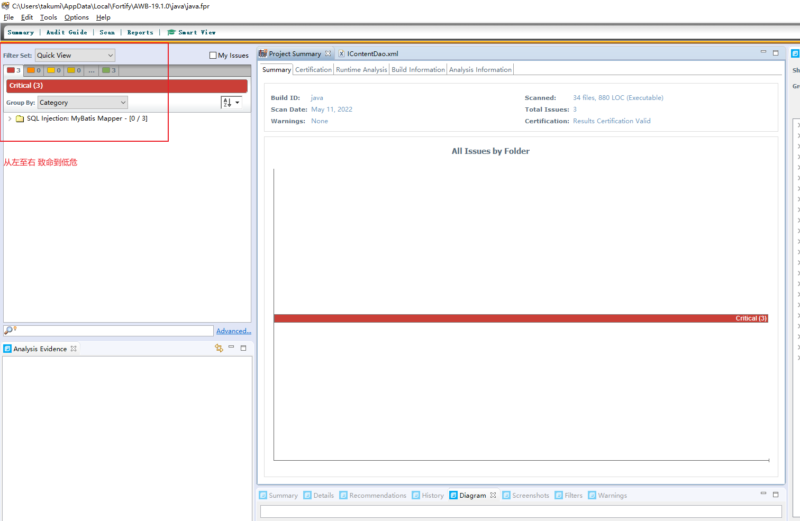
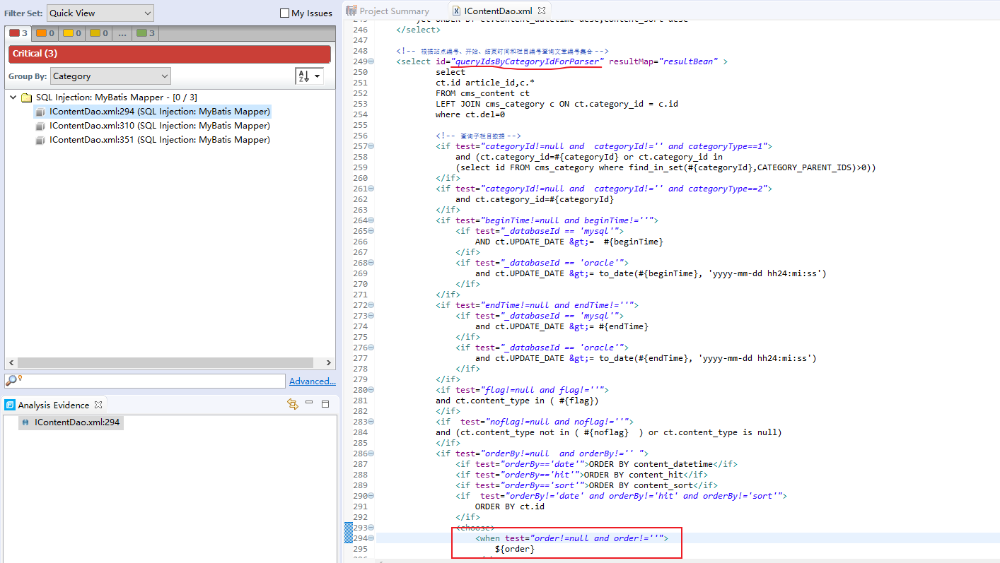
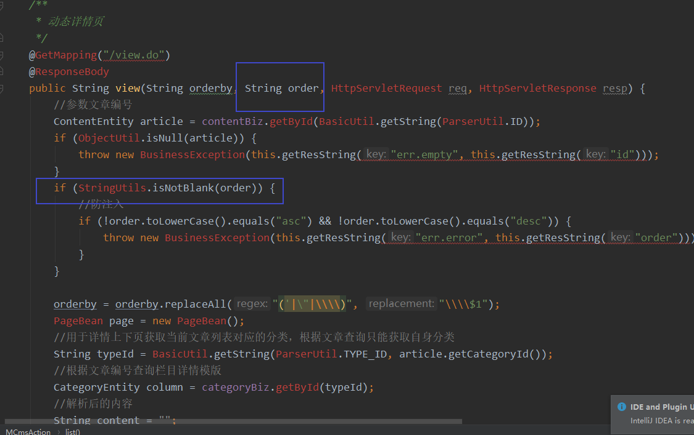

### 0x00代码审计过程
#### 0x01如何扫描
    todo
#### 0x02 fortify 扫描结果


#### 0x03 分析扫描结果
1. sql注入1：
   
    > mybatis 中 # 为预编译占位符 $为拼接占位符 id 是查询的方法名称，在xml头部会标注本xml映射的类
    1. 根据xml可以判断 order 字段存在sql注入风险
   
    2. 根据xml信息可以确定方法是 `IContentDao.queryIdsByCategoryIdForParser()`  通过全局搜索 `ctrl+shift+f` 或者 ctrl+左键点击方法名，找到调用点依次检查order参数
    
    
    3. ```
            //只有这一处调用有涉及到order参数 
            contentBean.setCategoryId(String.valueOf(typeId));
            contentBean.setOrderBy(orderby);
            contentBean.setOrder(order);
            List<CategoryBean> articleIdList = contentBiz.queryIdsByCategoryIdForParser(contentBean);```
         
    4. 跟踪发现order参数有白名单校验，无法完成利用
       
       
       
       ```shell
            if (StringUtils.isNotBlank(order)) {
                //防注入
                if (!order.toLowerCase().equals("asc") && !order.toLowerCase().equals("desc")) {
                    throw new BusinessException(this.getResString("err.error", this.getResString("order")));
                }
            }
       ```
2. `IContentDao.getSearchCount()` tableName、diyList参数存在注入风险 经检查 数据是直接从数据库获取用户无法直接输入，但是存在二次注入风险。


 