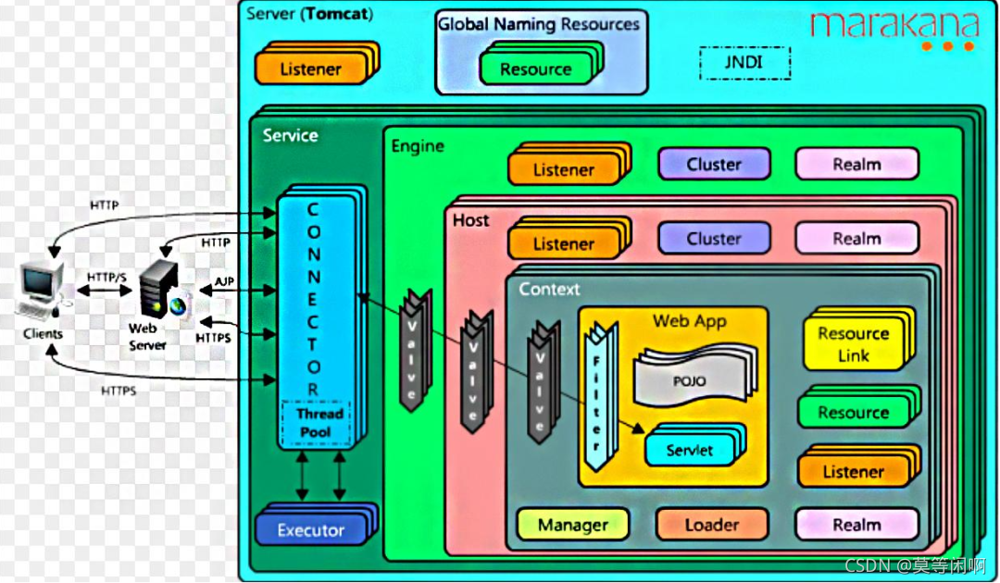

### 0 http 请求到java后端业务代码执行的流程

[toc]

#### 1 静态文件服务器(不进行代码解析)
1. 建立连接  （基于socket）
	1. 服务器监听端口接收到http请求时会临时分配一个用于通信的socket与客户端连接
2. 路由分发
	1.  一般来说会先配置站点的文件目录和访问根路径
	2.  根据请求路径和配置文件找到对应文件
3. 数据响应和关闭连接 略

#### 2 应用服务器 (tomcat)



  *** Tomcat只要一个Server，一个Server可以有多个Service，一个Service可以有多个Connection和Container**

  *** Service是对外提供服务的**

  *** Connector用于接收请求并将请求封装成Request和Response来具体处理**

  *** Container用于管理和封装Servlet，以及处理具体Request请求**

---


1. 与静态文件服务器的区别在于路由分发到响应的过程
2. 参数路由
  1. 服务器接收到请求 根据请求url匹配到对应的servlet(根据tomcat的架构图可知参数会经历Engine,Host,context,filter), 在具体应用前只有filter能做较为完善的全局过滤的作用(engine,host 只有映射关系) 
  2. filter 可以理解为servlet 的动态代理, 即servlet的输入输出都可以在filter中进行统一控制,常见的一些输入输出相关漏洞的过滤防护就是在filter中进行
  3. 
  > 参考 https://blog.csdn.net/MDX_BLSNT_KBQ/article/details/120568869

#### 3 springMVC应用中controller 和servlet 的区别

springMVC 流程图
	1. Servlet将所有请求都转发到DisPatcherServlet，然后DisPatcherServlet分发请求通过HandlerMapping(处理器映射器)和HandlerAdapter(处理器适配器)找到具体的Controller,controller只是一个javabean
	2. 个人理解springmvc应用就是一个servlet ,在springmvc应用中请求是先通过tomcat分发到Servlet->DispatcherServlet,然后DispatcherServlet会再次根据url进行分发处理后续流程

#### 4 springboot 和 springMVC 区别

> 百度词条:
>
> springboot : Spring Boot是由Pivotal团队提供的全新[框架](https://baike.baidu.com/item/框架/1212667)，其设计目的是用来[简化](https://baike.baidu.com/item/简化/3374416)新[Spring](https://baike.baidu.com/item/Spring/85061)应用的初始搭建以及开发过程。该框架使用了特定的方式来进行配置，从而使开发人员不再需要定义样板化的配置。通过这种方式，Spring Boot致力于在蓬勃发展的快速应用开发领域(rapid application development)成为领导者 
>
> springmvc: Spring MVC属于SpringFrameWork的后续产品，已经融合在Spring Web Flow里面。Spring 框架提供了构建 [Web](https://baike.baidu.com/item/Web/150564) 应用程序的全功能 MVC 模块。使用 Spring 可插入的 MVC 架构，从而在使用Spring进行WEB开发时，可以选择使用Spring的Spring MVC框架或集成其他MVC开发框架，如Struts1(现在一般不用)，Struts 2(一般老项目使用)等等。

从词条上看springboot(配置工具)和springmvc(web开发框架)不同的概念,不过在spring boot 开发web项目时会引入 spring-boot-starter-web (这个依赖会引入spring-webmvc) ,从依赖上看springboot开发web项目也是基于springMVC, springboot(web开发)目前多用于开发一些微服务项目或者前后端分离项目,没有使用视图解析模块,不分离项目也可引入对于的包例如struts2(爆了一堆漏洞,目前行内已经弃用)

```
    <dependency>
      <groupId>org.springframework</groupId>
      <artifactId>spring-webmvc</artifactId>
      <version>5.3.19</version>
      <scope>compile</scope>
    </dependency>
```

