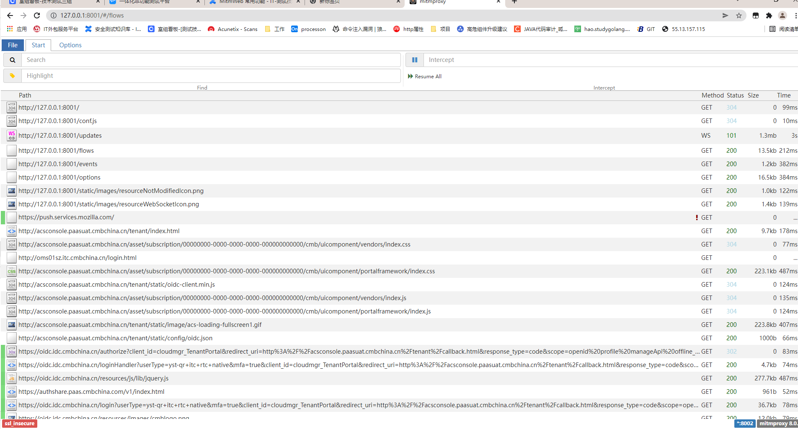
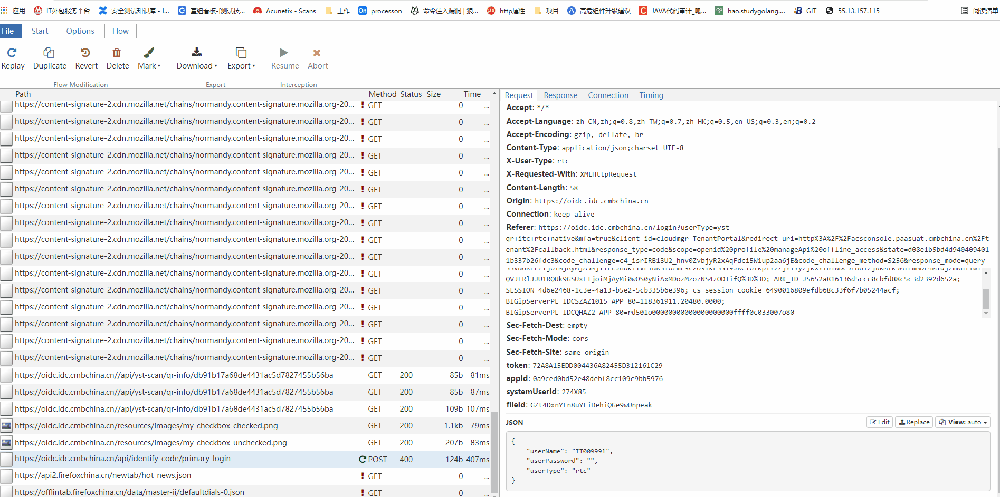

[TOC]

### mitmproxy

#### 0x01 introduce

> 顾名思义 mitmproxy 就是用于MITM(man-in-the-middle-attack)的代理，可定制修改请求或响应，通过代码的方式实现burp的抓包改包等功能

> 使用场景：行内很多系统的接口都有做加密加签处理导致无法使用工具进行扫描且手工构造payload时间成本过高。 在这种前提下可以通过 mitmproxy 代理加载自定义的脚本实现请求加密加签，我们只需要将请求的明文通过代理发送到服务端，代理自行进行加密加签的功能
[官网](https://docs.mitmproxy.org/stable)

#### 0x02 安装与启动

1. 安装 ```python -m pip install mitmproxy```

> 安装python的mitmproxy包后，会有mitmdump、mitmproxy、mitmweb三个可执行程序
>> 三者区别主要在于交互方式不同，功能本质无区别
>> 1. mitmproxy 以控制台形式交互 仅支持 linux
>> 2. mitmdump 以命令行交互
>> 3. mitmweb 以web形式交互
>>
>>  针对我们写拓展脚本无明显区别，以下以mitmdump举例

2. 启动命令 `mitmdump -s script.py -p port [-w file #]`

> eg: mitmdump -s proxy.py -p 8000

3. 证书：启动后使用该代理访问 http://mitm.it 下载对应证书

4. 可选参数

```
usage: mitmproxy [options]
#可选参数：

 -h, --help      show this help message and exit
 --version       show version number and exit
 --options       Show all options and their default values
 --commands      显示所有命令及其签名
 --set option[=value]	设置一个选项。 省略该值时，布尔值设置为true，字符串和整数设置为None（如果允许），并且序列为空。 布尔值可以为true，false或toggle
 -q, --quiet      Quiet.
 -v, --verbose     增加日志详细程度
 --mode MODE, -m MODE upstream 	模式可以是“常规”，“透明”，“ socks5”，“反向：SPEC”或“上游：SPEC”。 对于反向和上游代理模式，SPEC是主机规范，形式为“ http [s]：// host [：port]”
 --no-anticache
 --anticache     去除可能导致服务器返回304-not-modified的请求头
 --no-showhost
 --showhost      使用Host标头构造用于显示的URL
 --rfile PATH, -r PATH		从文件读取流量
 --scripts SCRIPT, -s SCRIPT	执行脚本。 可能会多次通过
 --stickycookie FILTER		设置粘性Cookie过滤条件，根据要求匹配
 --stickyauth FILTER  设置粘性身份验证过滤条件，根据要求匹配
 --save-stream-file PATH, -w PATH	流量到达时保存到文件（附加路径）。      
 --no-anticomp
 --anticomp      尝试令服务器向我们发送未压缩的数据。
 --console-layout {horizontal,single,vertical}		控制台布局
 --no-console-layout-headers
 --console-layout-headers		显示布局组件标题

#代理选项：

 --listen-host HOST  	绑定代理的地址到HOST
 --listen-port PORT, -p PORT	代理服务端口
 --no-server, -n
 --server      启动代理服务器（ 默认启用）
 --ignore-hosts HOST		忽略主机并转发所有流量，而不对其进行处理。 在透明模式下，建议使用IP地址（范围），而不要使用主机名。 在常规模式下，仅SSL流量会被忽略，应使用主机名。 利用正则表达式解释提供的值，并与ip或主机名匹配
 --allow-hosts HOST 与--ignore-hosts相反
 --tcp-hosts HOST   与--ignore-hosts相反。 对于与该模式匹配的所有主机，可以通过通用TCP SSL代理模式。 与--ignore相似，但是SSL连接被拦截。 通信内容以详细模式打印到日志中
 --upstream-auth USER:PASS	通过将HTTP基本身份验证添加到上游代理和反向代理请求。 格式：用户名：密码
 --proxyauth SPEC	需要代理身份验证。 格式：“用户名：密码”，“任何”以接受任何用户/密码组合，“ @ path”以使用Apache htpasswd文件或用于LDAP认证的“ ldap [s]：url_server_ldap：dn_auth：password：dn_subtree”
 --no-rawtcp
 --rawtcp       启用/禁用实验性原始TCP支持。 以非ascii字节开头的TCP连接将被视为与tcp_hosts匹配。 启发式方法很粗糙，请谨慎使用。 默认禁用
 --no-http2
 --http2        启用/禁用HTTP / 2支持。 默认情况下启用HTTP / 2支持

#SSL:

 --certs SPEC     形式为“ [domain =] path”的SSL证书。 该域可以包含通配符，如果未指定，则等于“ *”。 路径中的文件是PEM格式的证书。 如果PEM中包含私钥，则使用私钥，否则使用conf目录中的默认密钥。 PEM文件应包含完整的证书链，并将叶子证书作为第一项
 --no-ssl-insecure
 --ssl-insecure, -k  不要验证上游服务器SSL / TLS证书
 --key-size KEY_SIZE  证书和CA的TLS密钥大小

#客户端重发:

 --client-replay PATH, -C PATH		重发来自已保存文件的客户端请求

#服务端重发:

 --server-replay PATH, -S PATH		从保存的文件重发服务器响应
 --no-server-replay-kill-extra
 --server-replay-kill-extra		在重发期间杀死额外的请求。  
 --no-server-replay-nopop
 --server-replay-nopop		使用后，请勿从服务器重发状态中删除流量。 这样可以多次重发相同的响应。 
 --no-server-replay-refresh
 --server-replay-refresh		通过调整日期，到期和最后修改的header头，以及调整cookie过期来刷新服务器重发响应。   

#更换：

 --replacements PATTERN, -R PATTERN		替换形式：替换形式为``/ pattern / regex / replacement''，其中分隔符可以是任何字符。 可能会多次通过。

#设置Headers:

 --setheaders PATTERN, -H PATTERN		格式为“ /pattern/header/value”的标题设置模式，其中分隔符可以是任何字符。

#Filters:

有关过滤条件表达式语法，请参见mitmproxy中的帮助。

 --intercept FILTER  设置拦截过滤表达式。
 --view-filter FILTER 将视图限制为匹配流。
```

#### 0x03 拓展脚本demo

1. 脚本固定格式

```python
# -*-coding:utf-8 -*-
# version: python3.8.6
# author: he_yu
# start : mitmdump -s proxy.py -p port
# describe: 针对http请求自动进行md5加签的代理工具 
# datetime: 2022/6/23 16:15
import mitmproxy


class interceptor:
    # mitmproxy 加载本类时触发
    def __init__(self):
        pass

    # 重写request方法，flow会获取所有的http请求报文
    def request(self, flow: mitmproxy.http.HTTPFlow):
        # url       ->  flow.request.url        'http://xxx.com/a/b?asd'  
        # path       ->  flow.request.path        '/a/b?asd'  
        # headers   ->  flow.request.headers    MultiDict({'cookie':'123','sign':'asdasd'})  获取方式 headers['sign']
        # body      ->  flow.request.get_text()     文本格式
        # body (json格式)     ->  flow.request.json() 如果非json格式会报错
        # url flow.request.host -> host
        pass

    # 对响应的处理在以下的方法中定义
    def response(self, flow: mitmproxy.http.HTTPFlow):
        pass


addons = [
    interceptor()
]

```

2. demo

```python
# -*-coding:utf-8 -*-
# version: python3.8.6
# author: he_yu
# start : mitmdump -s proxy.py -p port
# describe: 针对http请求自动进行md5加签的代理工具 
# datetime: 2022/6/23 16:15
import json
import mitmproxy
import hashlib  # hash算法工具库 常用语md5 加密
from colorama import init

init(autoreset=False)


def printf(log, type=1):
    print(f'\033[3{type}m{log}\033[0m')  # 控制日志输出的颜色 1 红色 2 绿色  3 黄色


def md5_encode(data):  # md5加密
    enc = hashlib.md5()
    enc.update(data.encode("utf-8"))
    return enc.hexdigest()


def format_params(path):  # http 报文格式转换为加签的原文格式 
    params_str = path.split("?")
    l = []
    if len(params_str) > 1:
        params = params_str[1].split('&')
        params.sort()
        for param in params:
            if param.split('=')[1] != '':
                l.append(param)
        if not l:
            return params_str[0]
        return params_str[0] + '?' + '&'.join(l)
    else:
        return path


class interceptor:

    # mitmproxy 加载本类时触发
    def __init__(self):
        printf("proxy init")

    # 重写request方法，flow会获取所有的http请求报文
    # url       ->  flow.request.url        'http://xxx.com/a/b?asd'  
    # headers   ->  flow.request.headers    MultiDict({'cookie':'123','sign':'asdasd'})  获取方式 headers['sign']
    # body      ->  flow.request.get_text()     文本格式
    # body (json格式)     ->  flow.request.json() 如果非json格式会报错
    # url flow.request.url
    # url flow.request.url
    def request(self, flow: mitmproxy.http.HTTPFlow):
        if flow.request.host == "ibank-pc-asoc-st.paas.cmbchina.cn":
            if flow.request.method == 'GET':
                path = flow.request.path
                salt = "j9da6fld2khgz2chd354czbfd2b2fs3ea"
                path = format_params(path)
                encode_data = f"url={path}&body={salt}"
                printf(f"path = {path}---encode_data={encode_data}")
                flow.request.headers['Sign'] = md5_encode(encode_data)
                print(f'Sign = {flow.request.headers["Sign"]}')
                
            if flow.request.method == 'POST':
                path = flow.request.path
                body = flow.request.json()
                salt = "j9da6fld2khgz2chd354czbfd2b2fs3ea"  # 本例中的盐值
                encode_data = f"url={path}&body={json.dumps(body).replace(' ', '')}{salt}"
                printf(f"path = {path}---encode_data={encode_data}")
                flow.request.headers['Sign'] = md5_encode(encode_data)
                print(f'Sign = {flow.request.headers["Sign"]}')

    # 对响应的处理在以下的方法中定义
    def response(self, flow: mitmproxy.http.HTTPFlow):
        pass


addons = [
    interceptor()
]
```

#### python 常用数据类型

1. list

```python
if __name__ == '__main__':
    eg_list = [1, 2, 3, 4, 5]
    print(f' 3 == {eg_list[2]}')  # 直接根据索引可或取该位置的值
    eg_list[2] = 1212  # 赋值也是一样的操作
    print(eg_list)  # echo [1,2,1212,4,5]
    for index in range(0, len(eg_list)):  # 遍历

        print(eg_list[index])  # 依次输出 1 \n 2 \n  1212\n 4\n 5\n  \n换行
for value in eg_list:  # 遍历
    print(value)  # 依次输出 1 \n 2 \n  1212\n 4\n 5\n  \n换行
  ```

2. dict

```python
import json

if __name__ == '__main__':
    eg_dict = {'test': 'asd', 'token': 'ejasdasq14sf24a'}
    print(eg_dict['test'])  #>> asd  
    print(eg_dict['token'])  #>> ejasdasq14sf24a 
    eg_dict['token'] = 123
    print(eg_dict)  #{'test':'asd','token':123}

    #json <==> dict 
    json_str = json.dumps(eg_dict)  # json.dumps()  dict 转 json格式的字符串
    str_2_dict = json.loads(json_str)  # json.loads()  json格式的字符串 转 dict      
```

3. re

```python
import re  # 正则库


def get_host(url: str) -> str:
    """常见字符串处理和re库的使用
    :param url:str 
    :return str
    """
    host = re.findall('https?://(.*?)/+', url)  # 匹配后是获得list
    if host:  #如果不为空
        return host[0]
    return ''


if __name__ == '__main__':
    url = 'http://devops-kanban.paas.cmbchina.cn/troop/21205/troop-kanban/DAILY'
    host = get_host(url)
    #host devops-kanban.paas.cmbchina.cn


```

#### python 常用库

1. requests 用于http发包

```python
import requests

if __name__ == '__main__':
    url = 'https://www.baidu.com'
    headers = {
        'User-Agent': 'test'
    }
    response = requests.post(url=url, headers=headers, proxies={'http': '127.0.0.1:8080', 'https': '127.0.0.1:8080'},
                             timeout=2, verify=False)
    response = requests.request('POST', url=url, headers=headers,
                                proxies={'http': '127.0.0.1:8080', 'https': '127.0.0.1:8080'}, timeout=2, verify=False)
    print(response.text)  # 响应文本
    print(response.status_code)  # http 状态码
    print(response.headers)  # 响应headers 返回时一个字段

```

2. 常见加密&编码

```python
import hashlib
import base64
import urllib
# 行内国密加密库 pip install ZA33_CMBSM 针对
import CMBSM
from CMBSM.CMBSMFunction import CMBSM2Encrypt
from CMBSM.utils import com

"""
AES、RSA等自行百度~
"""


def base64_encode(data: str):
    """ 对参数进行base64 编码
    :param data:str 待编码数据
    :return str:str 编码后的数据
    """
    data_byte = data.encode()  # str -> bytes
    data_encode = base64.b64encode(data_byte)
    return data_encode


def md5_encrypt(data: str):
    """ md5 加密
    :param data:str  待加密数据 
    :return str:str  编码后的数据
    """
    md5 = hashlib.md5()  # hashlib 有常见的hash算法 sha256 sha1 等等
    md5.update(str.encode())
    return md5.hexdigest()


def url_encode(data: str):
    """ url 编码
    :param data:str  待编码数据 
    :return str:str  编码后的数据
    """
    return urllib.parse.quote(data)


def url_encode(data: str):
    """ url 解码
    :param data:str  待解码数据 
    :return str:str  解码后的数据
    """
    return urllib.parse.unquote(data)


def sm2_encrypt(public_key: str, data: str) -> str:
    """ sm2 加密、 如果前端加密使用 msk-lib-min.js或者公钥和密文固定以04开始 则说明使用的行内国密加密
    :param public_key 加密公钥
    :param data 待加密数据
    """
    enc_data = CMBSM2Encrypt(com.aschex_to_bcdhex(public_key), data)  # sm2加密
    return enc_data


```

#### mitmweb 
> mitmweb 用法与mitmdump 基本一致，但是mitmweb在启动时会多监听一个端口用户web服务 
```shell
> mitmweb --web-port 8001 -p 8002 -s xxx.py  --mode upstream:http://127.0.0.1:8080 --ssl-insecure
Web server listening at http://127.0.0.1:8001/
Proxy server listening at http://*:8002
```
1. 抓包
> 经过代理的流量均会在web中显示
> 

2. 重放 
    1. 以修改oidc的预登陆密码为例
    2. 

3. 拦截
    1. 在 start -> intercept 中输入需要拦截的请求
    2. 
    3. ```python
    The following operators are understood:

        ~q          Request
        ~s          Response

    Headers:

        Patterns are matched against "name: value" strings. Field names are
        all-lowercase.

        ~a          Asset content-type in response. Asset content types are:
                        text/javascript
                        application/x-javascript
                        application/javascript
                        text/css
                        image/*
                        font/*
                        application/font-*
        ~h rex      Header line in either request or response
        ~hq rex     Header in request
        ~hs rex     Header in response

        ~b rex      Expression in the body of either request or response
        ~bq rex     Expression in the body of request
        ~bs rex     Expression in the body of response
        ~t rex      Shortcut for content-type header.

        ~d rex      Request domain
        ~m rex      Method
        ~u rex      URL
        ~c CODE     Response code.
        rex         Equivalent to ~u rex
```
    