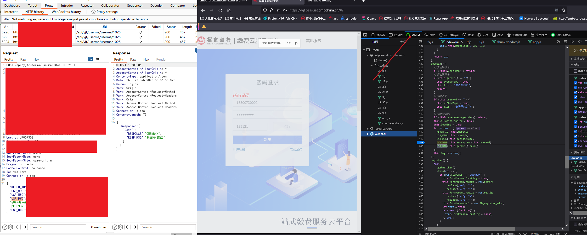
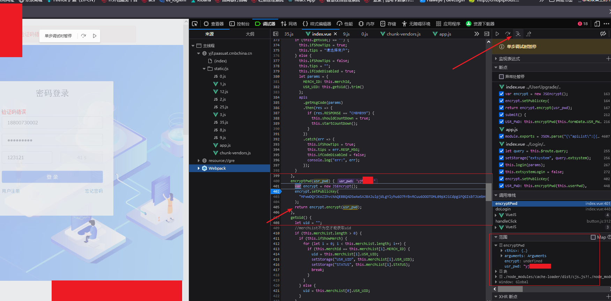
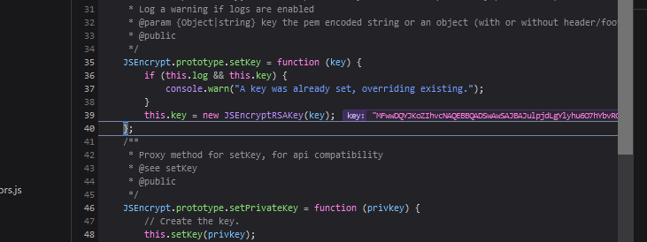
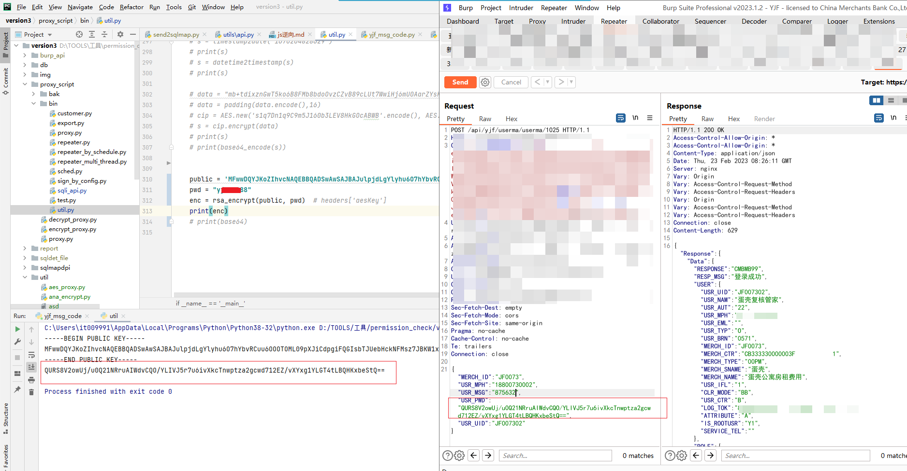
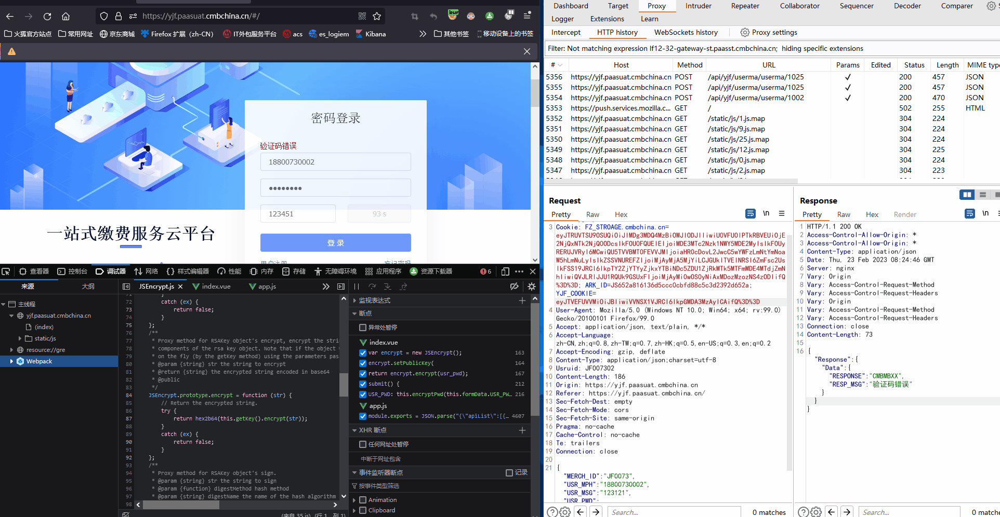

### JS 逆向
> 通过走读、debug、hook等方式，了解js针对请求的加密加签等功能
>
> debug 中 
>
> 断点 : js在执行到断点处时会暂停,可查看内存堆栈的数据
>
> 步进:  F11 逐步进入js的调用链 ,如果有子函数也会依次进入调用链 
>
> 步出 : shift + F11 跳出当前函数的调用步骤.
>
> 跨越: F10  逐行执行,如果有子函数直接跳过
>
> 恢复: F8  进入下一个断点
>
> 
#### 1. 浏览器debug
1. 通过关键字如：`接口地址，加密参数名，enc，sign，接口的错误提示信息等定位到js的入口` 本例通过密文的参数名定位(简便方法可以在代理 如burp 中搜索关键字 检查在哪些js中)

2. 通过 `F11`  或者右上角的步进 进入pwd 的加密逻辑

3. 如上图可获取公钥和加密原文
4. 依次步进 和步出可知该密码加密方式为rsa,密钥如图所示

5. 通过上述原文以及加密方式 使用对应的加密工具生成密文进行测试验证

6. 完整流程gif

#### 2. 控制台 hook

#### 3. 油猴插件hook

#### 4. 代理hook/代理修改响应实现修改js

