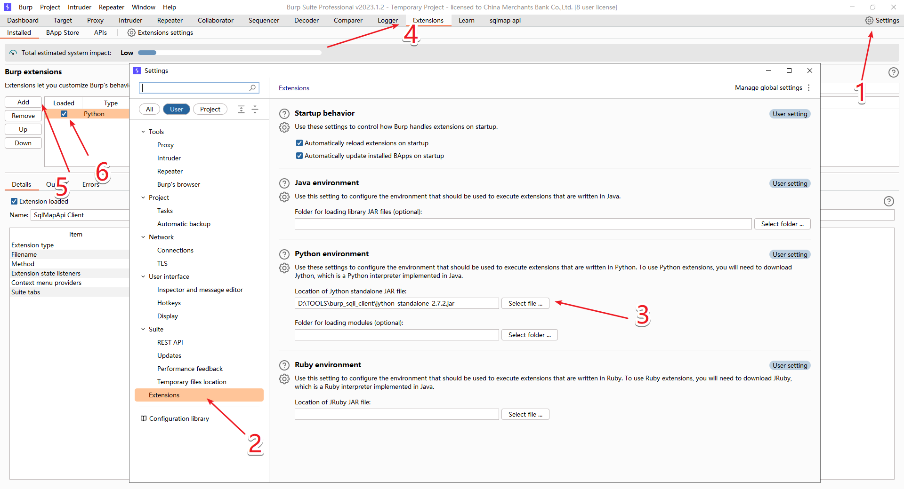
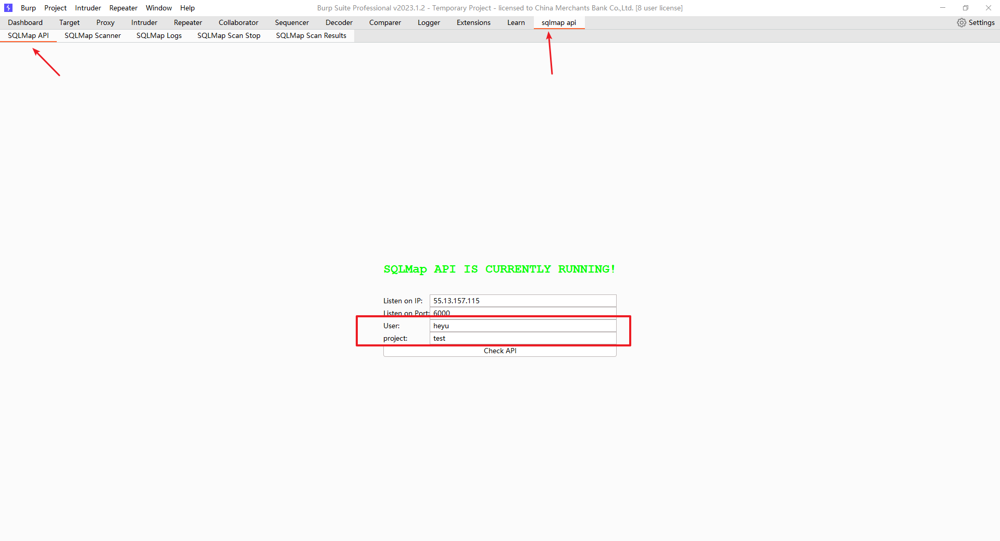
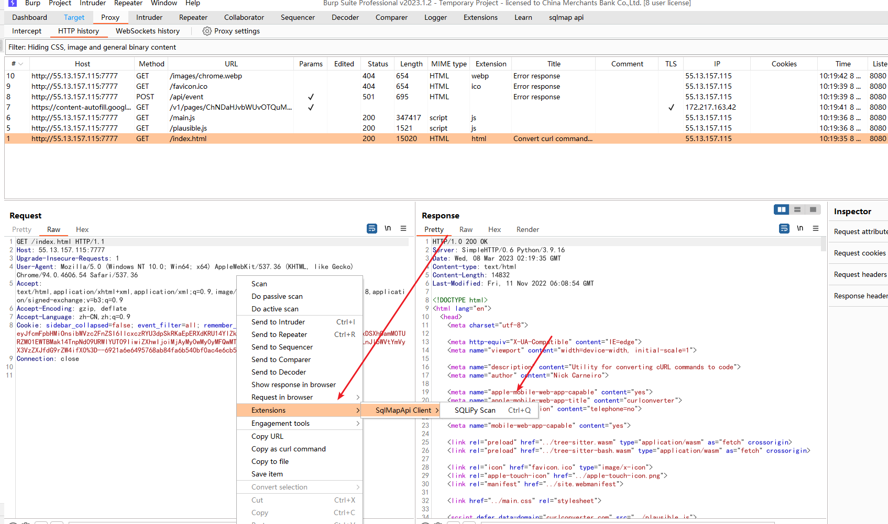
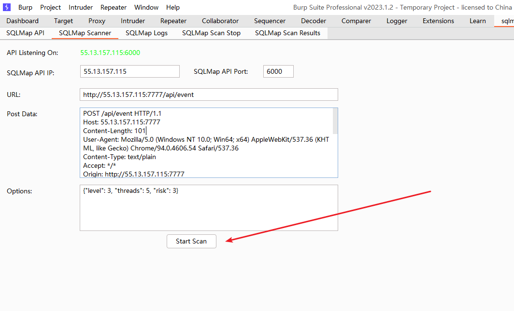

### sqlmap api burp插件
基于[sqlipy](https://github.com/codewatchorg/sqlipy)做了一些个人功能调整  
#### 0x01 插件安装
> 环境 jython 
1. Setting > Extensions > Python environment > jython-standalone-2.7.2.jar  
2. Extensions > installed > add > sqlmapapi_client.py
    

#### 0X02 插件使用
0. 启动sqlmap api服务端
    1. 将本目录的api.py 替换sqlmap中的lib/utils/api.py 文件
    2. 回到sqlmap根目录 通过命令 python sqlmapapi.py -s -p port -H host 启动
    3. 

1. 初始配置 项目名称根据具体项目进行配置，api根据项目筛选的查询结果
    
2. 创建扫描任务
    1. 通过右键功能中的Extension -> sqlmap
    2. 
    3. 

3. 查看扫描结果 & 日志
    1. 
    
#### 功能说明
1. SAVE Config
    1. 会保存启动页的配置(ip、port、user、project)以及扫描页中的扫描配置(scanner -> options )

